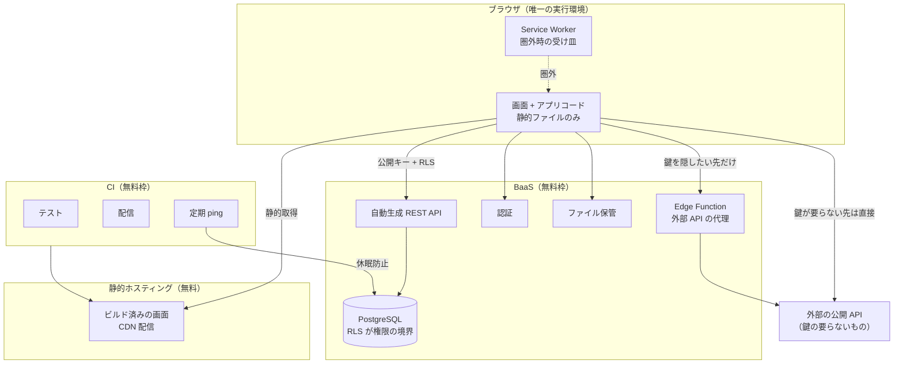

# 構成とデプロイの参考資料

個人〜少人数向けの Web アプリを、**課金経路を 1 つも持たずに**運用するための構成と、
その配り方をまとめたもの。このリポジトリで実際に動いている仕組みを、
別のシステムでも使えるように一般化してある。

**設定値・鍵・エンドポイント・プロジェクト ID の類は一切書いていない。**
それらは環境変数と GitHub Secrets にだけ置く、というのがこの構成の前提でもある。

---

## 0. 先に、向き不向き

| 向いている | 向いていない |
|---|---|
| 利用者が数人〜数十人。招待制で増え方が読める | 不特定多数に公開して伸ばしたい |
| データの整合性を DB で担保できる（複雑な業務トランザクションが無い） | 複数サービスをまたぐ分散トランザクションが要る |
| 画面が静的配信で足りる（SSR・SEO が要らない） | 検索流入が事業の柱 |
| 落ちても数時間は困らない | SLA を約束する |
| 作る人と使う人が近い（要望を直接聞ける） | 要件が組織の合意で決まる |

**この構成の本質は「サーバーを 1 台も持たない」こと。** 動くコードは
ブラウザの中と、DB の中と、関数の中の 3 か所にしかない。
置き場所が減れば、壊れる場所も、金がかかる場所も減る。

---

## 1. 全体像



**要点は 3 つ。**

1. **アプリコードとデータの間にサーバーを置かない。** ブラウザが直接 DB の
   API を叩く。守るのはネットワークではなく **DB 側の行レベル権限**。
2. **外部 API は、鍵が要るものだけ関数を挟む。** 鍵の要らない API は
   ブラウザから直接叩く。挟むほど遅くなり、無料枠も減る。
3. **CI は「テストして配る」以上のことをしない。** ビルド成果物は静的ファイルだけ。

---

## 2. 費用ゼロが成り立つ条件

無料枠は「使わなければ無料」ではなく、**制約を設計に取り込めば無料**。
実際に効いてくる制約は次の 4 つ。

### 2.1 休眠する

多くの BaaS 無料枠は、一定期間アクセスが無いとプロジェクトを止める。
**CI の定時実行で 1 日 1 回叩いて起こしておく。**

ここに落とし穴がある。**「DB に届くリクエスト」でなければ意味が無い。**
API のルート（スキーマを返すだけの入口）を叩いても休眠判定は変わらない。
**公開読み取りできるマスタ表を 1 行だけ取る**のが確実で、いちばん軽い。

```yaml
# 定時 + 手動の両方で動かせるようにしておく。
# 失敗が続いたときだけ気づきたいので、数回リトライしてから落とす。
on:
  schedule:
    - cron: "0 21 * * *"   # UTC で書く。ローカル時刻から必ず変換する
  workflow_dispatch:
```

- **秘密が未設定なら警告して正常終了させる。** フォークや他人の環境で
  毎朝メールが飛ぶのを避けられる。
- **一時的な失敗で落とさない。** 数十秒あけて 3 回試す。

### 2.2 転送量とストレージ

写真のような重いものは**クライアント側で縮めてから上げる**。
上限（例: 数 MB）を UI で先に弾き、通ってしまったものを後で消す運用にしない。

### 2.3 プロジェクト数

無料枠は「組織あたり有効なプロジェクト N 個」で数えることが多い。
**検証用に 1 つ空けておけるか**を最初に確認しておくと、
後で移行やリハーサルをしたくなったときに詰まらない。

### 2.4 リージョン

**作るときに選ぶ。後から変えられないと思って選ぶ。**
多くの BaaS にリージョン変更機能は無く、新しく作って中身を移すことになる。

利用者の居場所から遠いリージョンを選ぶと、**画面を開くたびに数往復ぶんの
遅れ**が積まれる。1 往復の差は近隣リージョンと数千 km 先で 60〜70ms あり、
起動時に 5〜6 往復あれば 0.3〜0.4 秒になる。転送量ではなく**往復回数**で効く。

---

## 3. 配り方

### 3.1 何を配るか

静的ファイルだけ。**ビルド工程を持たない**（素の CSS と ES モジュール、
依存ライブラリはリポジトリに同梱）という選択も十分に成立する。
その場合、CI がやるのは「版を打って、そのまま上げる」だけになる。

外部ライブラリを同梱するときは、**同じ場所にバージョンを書いたテキストを置く**。
何が入っているか分からない `vendor/` はいずれ触れなくなる。

### 3.2 版を打つ（ここがいちばん大事）

静的ホスティングは HTML も CSS も JS も**短い max-age で配る**。
版を付けないと、端末に古いものが残って
**「配ったのに変わらない」**が必ず起きる。

CI の配信ジョブで、コミットハッシュの先頭 8 桁を全部に刻む。

```bash
V="${GITHUB_SHA::8}"

# ① 資産の URL に版を付ける（中身が変われば URL が変わる＝必ず取り直される）
sed -i -e "s#assets/app\.js\"#assets/app.js?v=$V\"#g" *.html

# ② コード中の目印を実際の版に差し替える
sed -i -e "s#__APP_VERSION__#$V#" assets/app.js sw.js

# ③ 画面から取り直して新旧を比べるための版ファイル
printf '{ "v": "%s" }\n' "$V" > assets/version.json

# ④ **差し替わったことを確かめる。** ここが無いと、置換が空振りしても
#    そのまま配ってしまう。sed は当たらなくても成功で返る。
grep -q "$V" assets/app.js
! grep -q "__APP_VERSION__" assets/app.js sw.js
```

**④ を必ず書く。** 置換の目印を変えたときに壊れるのはここで、
壊れても CI は緑のまま、端末にだけ古いものが残る、という最悪の形で出る。

### 3.3 更新に気づかせる

版を打っても、**すでに開いている画面**は古いまま。
画面を開くたびに版ファイルを `no-store` で取り、
自分の版と違えば**帯を出してタップで読み直させる**。

```js
export const APP_VERSION = "__APP_VERSION__";

async function checkForUpdate() {
  if (APP_VERSION.startsWith("__")) return;   // 手元では差し替わっていない
  try {
    const res = await fetch(`assets/version.json?t=${Date.now()}`, { cache: "no-store" });
    const latest = (await res.json()).v;
    if (latest && latest !== APP_VERSION) showUpdateBar();
  } catch { /* 圏外なら黙って諦める */ }
}
```

- **勝手に読み直さない。** 入力途中を消される。押してもらう。
- **手元で動かしているときは何もしない。** 目印が残っているかどうかで判別できる。

### 3.4 Service Worker は「役割で分ける」

Service Worker のキャッシュは HTTP キャッシュと違い、**自分で消すまで残る**。
何も考えずに入れると 3.2 の問題がもっと悪い形で戻ってくる。
**種類ごとに戦略を変えるのが唯一の正解。**

| 対象 | 戦略 | 理由 |
|---|---|---|
| 画面（HTML） | ネットワーク優先 | オンラインで古い画面を出さない。圏外のときだけ手持ち |
| 版付きの資産（`?v=`） | キャッシュ優先 | 中身が変われば URL が変わるので、古いものを掴み続けない |
| 日付で値が確定するデータ | キャッシュ優先・**裏で取り直さない** | 同じ URL なら中身も同じ。取り直しは電池と通信の無駄 |
| 自分のデータ・予報 | ネットワーク優先 | 新しいほうが正しい。圏外のときだけ手持ち |
| 認証・署名付き URL | **触らない** | トークンをため込む意味が無く、危険 |

殻のキャッシュ名に版を含め、`activate` で古い名前を消す。
**先読みリストに入れる資産は「版付きのまま」入れる**（キャッシュの鍵は URL そのもの）。
ここを素の URL で入れると、圏外で画面だけ出て中身が動かない、という
いちばん困る状態になる。

### 3.5 配信の起動条件

```yaml
on:
  push:
    branches: [main]
    paths:
      - "frontend/**"              # 画面に関係するものだけ
      - ".github/workflows/pages.yml"
  workflow_dispatch:               # 手で押せる口も残す

concurrency:
  group: pages
  cancel-in-progress: true         # 連続 push で追い越しが起きないように
```

---

## 4. DB の変え方

### 4.1 連番の SQL と、適用台帳

```
db/
  migrations/     001_....sql, 002_....sql … 連番。**一度配ったものは書き換えない**
  tests/
    baseline.sql      いまの本番と同じ「出発点」のスキーマ
    test_migrations.sql   適用後に成り立つべきことを書いた検査
  seeds/
```

適用済みかどうかは **DB の中の台帳表**で管理する。
この表は運用専用なので、**自動生成 API から触れないようにしておく**。

```sql
CREATE TABLE IF NOT EXISTS _migrations (
  name       TEXT PRIMARY KEY,
  applied_at TIMESTAMPTZ DEFAULT NOW()
);
-- 多重防御: API のロールから権限を剥がし、ポリシーを 1 つも書かずに RLS を有効化
REVOKE ALL ON _migrations FROM <api_roles>;
ALTER TABLE _migrations ENABLE ROW LEVEL SECURITY;
```

### 4.2 CI で「出発点から全部当てる」

**毎回まっさらな DB を作り、baseline を入れて、全マイグレーションを順に当て、
最後に検査 SQL を流す。** これで次の 3 つが同時に守れる。

- 連番の順序で通ること（後の SQL が前提を壊していないこと）
- 何度当てても壊れないこと（`IF NOT EXISTS` / `CREATE OR REPLACE` の徹底）
- トリガー・関数・制約が意図どおり動くこと

```bash
set -euo pipefail
dropdb --if-exists "$DB"; createdb "$DB"
psql -v ON_ERROR_STOP=1 -d "$DB" -f tests/baseline.sql
for m in migrations/*.sql; do psql -v ON_ERROR_STOP=1 -d "$DB" -f "$m"; done
psql -v ON_ERROR_STOP=1 -d "$DB" -f tests/test_migrations.sql
```

CI 側は使い捨ての PostgreSQL サービスコンテナを立てるだけでよい。
**本番と同じメジャーバージョンを指定する。**

### 4.3 本番への適用

管理 API に SQL を POST する小さなスクリプトを 1 本持つ。
**DB への直結（5432）もパスワードも要らない**のが利点で、
公開リポジトリに置いても危険が増えない。

```
apply            未適用の SQL を名前順に当て、台帳に記録する
apply --dry-run  当てる対象だけ表示する
inspect          テーブル・ビュー・RLS の有無・カラムを表示する
sql "..."        任意の SQL を 1 回投げる
```

**この経路は管理者権限で走り、行レベル権限を素通りする。**
アプリ側の入口とは別物だと、はっきり意識して扱うこと。
運用ルールとして最低限これだけは決めておく。

- **条件なしの DELETE / UPDATE を打たない。**
- **検証データは、機械的に選べる印を付ける**（専用ドメインのメール、
  決まった接頭辞の名前など）。片付けは必ずその印だけを条件にする。
- 実データと同じ表に検証データを入れるなら、**入れる前に件数を控える**。
  片付けたあと同じ件数に戻ったことを確かめる。

---

## 5. 権限は DB に置く

ブラウザが直接 API を叩く以上、**行レベル権限（RLS）が唯一の境界**。
ここが破れたら他に何も守るものが無い、という前提で書く。

### 5.1 公開キーは公開されている前提で考える

配布用の公開キーはブラウザに配られるので、**そのキーだけで通る API は
実質誰でも叩ける**。「キーを知らないから安全」は成り立たない。

### 5.2 ポリシーの中から別の保護テーブルを見ない

参照先にも RLS が掛かっていると、判定が再帰したり、
意図せず行が消えたりする。**所有者権限で動く小さな補助関数を挟む。**

```sql
CREATE FUNCTION shares_group_with(other_user UUID) RETURNS BOOLEAN
LANGUAGE sql SECURITY DEFINER STABLE SET search_path = public
AS $$
  SELECT EXISTS (
    SELECT 1 FROM group_members mine
    JOIN group_members theirs ON theirs.group_id = mine.group_id
    WHERE mine.user_id = auth.uid() AND theirs.user_id = other_user
  );
$$;
```

- **`SET search_path` を必ず付ける。** 付けないと呼び出し側から
  参照先をすり替えられる。
- **`STABLE` を付ける。** 同じ問い合わせの中で何度も評価されるのを防ぐ。

### 5.3 所有者権限で動くビューは、WHERE 句が境界そのもの

呼び出し元の権限で動かないビューは、**その WHERE 句を書き間違えた瞬間に
全行が漏れる**。既定値に頼らず、**毎回どちらなのかを明示して書く**。

```sql
CREATE VIEW record_feed WITH (security_invoker = false) AS
  SELECT ... WHERE <ここが境界そのもの>;
```

### 5.4 整合性もできるだけ DB に置く

トリガー・制約・RPC で担保できるものは、アプリに書かない。
入口が複数（画面・スクリプト・管理 API）ある構成では、
**アプリ側のチェックは必ずどこかで素通りされる。**

---

## 6. 運用を自動化する

**人がやることを「一度きりのセットアップ」と「承認」だけに寄せる。**
そのために、ダッシュボードでの手作業をすべて API 呼び出しに置き換える。

| 作業 | 置き換え先 |
|---|---|
| スキーマ変更 | 管理 API へ SQL を POST するスクリプト |
| 関数のデプロイ | 管理 API へソースを POST するスクリプト |
| 画面の配信 | CI（push で自動） |
| 休眠防止 | CI（定時） |
| **鍵の発行・登録** | **人**（これだけは委譲しない） |
| **PR の確認とマージ** | **人** |

### 6.1 鍵の置き場所

| 置き場所 | 入れるもの |
|---|---|
| 実行環境の環境変数 | 管理 API のトークン、プロジェクト識別子 |
| CI の Secrets | 定期実行などに要る最小限のもの |
| リポジトリ | **公開前提のキーだけ**（それも「公開されている」前提で設計する） |

**スクリプトは環境変数からしか読まない。** 引数やファイルから読めるようにすると、
いつかコマンド履歴やログに残る。

### 6.2 小さなハマりどころ

- 管理 API の前段に WAF がいることがあり、**既定の HTTP クライアントの
  User-Agent が弾かれる**ことがある。明示的に名乗る。
- スクリプトは**識別子を複数の環境変数から復元できる**ようにしておくと、
  設定ミス（キーと識別子の取り違え）から立ち直れる。

---

## 7. テストの組み立て

### 7.1 3 層に分け、CI では並列に走らせる

| 層 | 何を確かめるか | 要るもの |
|---|---|---|
| DB | マイグレーションの順序・トリガー・制約・RPC | 使い捨ての PostgreSQL |
| 外部連携（関数） | 外部データのパース。**取得ではなく解釈**を試す | 型検査 + 単体テスト |
| フロント | 純粋関数（計算・整形・判定） | Node のみ |

**通信を伴うテストを CI に入れない。** 外部サイトの都合で赤くなるテストは、
いずれ誰も見なくなる。外部データは**保存した実物**に対して解釈を試す。

### 7.2 ブラウザ前提のモジュールを Node で試す

画面用のモジュールはブラウザ固有のグローバルに依存していて、そのままでは
読み込めないことが多い。**ソースから必要な範囲だけ文字列で切り出して評価する**
という手が使える。ただし——

**この切り出しは、目印にした行が動いたり消えたりすると黙って壊れる。**
切り出しの道具を 1 か所にまとめ、**壊れたときに「どの範囲を切ろうとしたか」を
言わせる**。そうしないと、無関係な構文エラーだけが出て原因に辿り着けない。

```js
try {
  new Function(code);            // 組み立てた結果が読めるか、ここで先に試す
} catch (e) {
  throw new Error(`切り出したコードが読めない（目印を見直す）\n`
    + `  切ろうとした範囲:\n    ${ranges.join("\n    ")}\n`
    + `  中身のエラー: ${e.message}`);
}
```

### 7.3 テストが本当に落ちることを確かめる

**新しいテストは、直す前のコードに当てて赤くなることを見てから通す。**
これをやらないと「書いたが何も見ていないテスト」が積み上がる。

### 7.4 成否は終了コードで見る

出力を数えて判定しない（`grep -c "^FAIL"` の類）。
**実行そのものが失敗したときに 0 件と数えてしまう。**
`make` はリポジトリのルートから走らせる。別の場所から走らせて出た失敗を
テストの失敗と読み違えることが実際に起きる。

---

## 8. 決めたことの残し方

コードのコメントは「どう動くか」、こちらは「**なぜそう決めたか**」。
仕組みが同じでも、この 2 つは読み手が違う。

### 8.1 判断の記録

連番の見出しで 1 ファイルに追記していく。**書くのは 4 つ。**

1. **何を決めたか**
2. **なぜそう決めたか**（採らなかった案と、その理由も）
3. **どう確かめたか**（測った数字、試した手順）
4. **前の判断を取り消すなら、取り消したと明記する**

4 が抜けると、後から読んだときに矛盾した記録が 2 つ並ぶ。
**古いほうを消さずに「取り消した」と書く**のが要点で、
消してしまうと「なぜ戻したのか」が失われる。

### 8.2 使う人向けの記録

判断の記録とは**別のファイル**に、使う人の言葉で書く。
画面の見た目や動きを変えたら必ず 1 件足す、という運用にすると、
「配ったのに気づかれない」が減る。

- **内部の用語・仕組み・理由は書かない。** 画面名と操作で書く。
- **時刻はタイムゾーンを固定して書く。** CI やコンテナは UTC で動いていることが多く、
  ログの時刻をそのまま書き写すとずれる。**変換コマンドを運用ルールに書いておく。**
- 同じ機能を同じ日に何度も直したときは、**新しく足さず前の 1 件にまとめる**。
  経過ではなく**いまどうなっているか**を書く。

### 8.3 設計する前に測る

このリポジトリで繰り返し効いたのはこれ。
**思い込みで画面を作らず、実データを数えてから決める。**

- 「ほとんど同じ値になるから、この表示は要らないのでは」→ 数えたら 61% で、要る
- 「この週は全部同じ値だから飽和している」→ **1 週間だけ見て言うと間違える。**
  90 日数えたら散っていた

同じ理由で、**1 回の観測で結論を出さない**。範囲を広げて数え直す。

---

## 9. 別のシステムに持っていくときの順番

- [ ] **リージョンを決める。** 利用者の居場所から最も近いところ。後から変えられない
- [ ] **無料枠の数え方を確認する。** プロジェクト数・転送量・ストレージ・休眠条件
- [ ] リポジトリを作り、静的配信を有効にする
- [ ] 管理 API のトークンを発行し、**実行環境の環境変数にだけ**入れる
- [ ] マイグレーションの置き場と台帳表、適用スクリプトを用意する
- [ ] **baseline + 全適用 + 検査**を CI に入れる（最初の 1 本目から）
- [ ] RLS を有効にし、**補助関数とビューの権限の書き方を最初に決める**
- [ ] 配信ジョブに**版打ちと、その検証行**を入れる
- [ ] 版ファイルと更新の帯を入れる
- [ ] Service Worker を入れる（**役割ごとの戦略表を先に書いてから**）
- [ ] 休眠防止の定時ジョブを入れる（**DB に届く問い合わせで**）
- [ ] 判断の記録と、使う人向けの記録、2 つのファイルを作る
- [ ] 検証データの印（メールドメイン・名前の接頭辞）と片付け手順を決める

---

## 10. この構成の限界

正直に書いておく。

- **配信の巻き戻しが「もう 1 回配る」しかない。** 前のコミットに戻して押し直す。
  即座に戻す仕組みは無い。
- **DB の巻き戻しが難しい。** マイグレーションに戻す SQL を書いていないなら、
  バックアップからの復元になる。無料枠のバックアップ保持期間は短い。
- **リージョンを間違えると作り直し。** 5 章の権限設計や 4 章の台帳があれば
  移送はできるが、半日仕事になる。
- **監視が無い。** 落ちても誰も教えてくれない。定時 ping が失敗したら
  気づく、という程度の網しか無い。
- **利用者が増えると無料枠を出る。** そのとき最初に出るのは、たいてい
  ストレージか転送量。**画像を持つなら、そこが最初の天井**だと思っておく。

これらが許容できないなら、この構成は選ばない。
許容できるなら、**運用にかかる金と手間は本当にゼロ**になる。
